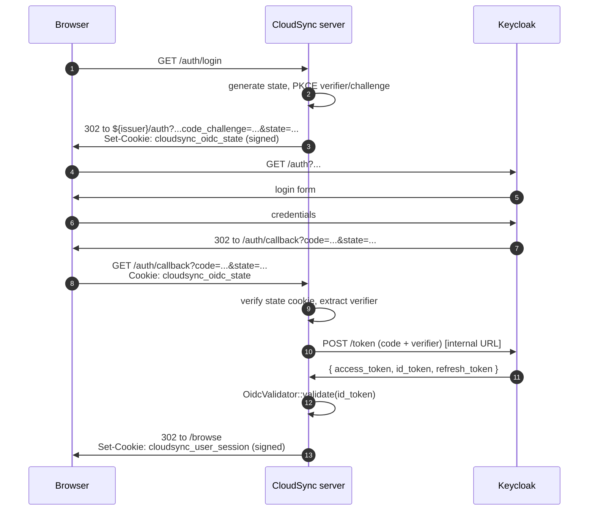
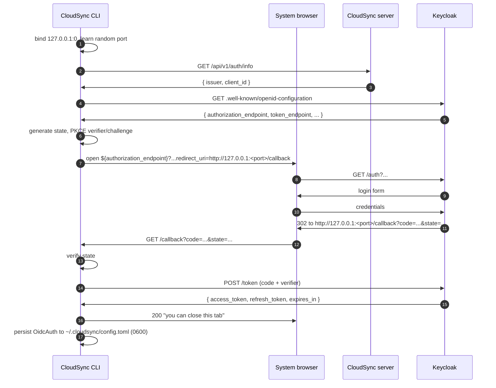

# Keycloak Login: Web UI + CLI

## Context

CloudSync's server already validates OIDC access tokens for the JSON API — `OidcValidator` in `crates/cloudsync-server/src/oidc.rs` is wired into `bearer_auth_layer` and accepts JWTs alongside the legacy static token. What's missing is the **login side** of the story:

- **Web UI:** `/login` only accepts the shared static token via a form. There's no way for a real Keycloak user to sign in to the browser UI as themselves.
- **CLI:** `cloudsync init --token <T>` writes the static token to `~/.cloudsync/config.toml`, and every API call sends it as `Authorization: Bearer <T>` (see `crates/cloudsync-client/src/client.rs:36,65,85,…`). All CLI users share one identity and one tenant.

This plan adds Keycloak login on both surfaces, sharing as much code and infrastructure as possible. After it ships:

- Browser users click "Sign in with Keycloak", land on a Keycloak login page, return as their own identity.
- CLI users on a laptop run `cloudsync login` and complete login in their browser via a loopback redirect.
- CLI users on a headless box (SSH, CI, NAS) run `cloudsync login --mode device` and complete login from another device.
- The static token stays as a fallback for both surfaces.

## Why everything in one feature

The three flows look different but share most of the parts that matter:

- **Token storage** in the client (`refresh_token`, `expires_at`, mode tag in `config.toml`).
- **Token refresh** logic — once you've got tokens, refresh is identical regardless of how you got them.
- **Realm config** — `keycloak/realm-cloudsync.json` needs one small change (enable device flow) to support all three.
- **Pre-call token resolution** in the client — a `TokenSource` abstraction that returns a valid access token on demand, whether the source is a static string or a refreshing OIDC session.

Splitting them into separate features would mean writing the same framing twice.

## What `state` and PKCE defend against

Both are required, and they protect different attacks.

**PKCE** (Proof Key for Code Exchange, RFC 7636) protects the **code → token exchange**. The client generates a random `code_verifier` per login attempt, sends `code_challenge = SHA256(verifier)` in the auth request, and proves possession of the verifier when exchanging the code. If an attacker steals the code (logged URL, malicious app intercepting a `127.0.0.1` redirect, network log before TLS termination), they can't redeem it without the verifier. Replaces the client secret entirely for public clients, and OAuth 2.1 mandates it everywhere.

**`state`** protects the **callback** against CSRF. Without it, an attacker can trick the victim's browser into completing the *attacker's* login: the victim ends up authenticated as the attacker, and anything they upload goes into the attacker's tenant. The server generates a random `state` on login start, stashes it (in our case in a signed cookie), and rejects the callback if the value in the query string doesn't match. The attacker can't forge the cookie, so they can't match the state.

PKCE alone doesn't catch the CSRF case — the token exchange in that flow uses the attacker's own legitimate verifier with their own code, so it succeeds cryptographically. `state` is what binds a callback to a specific in-progress login on a specific browser.

We use both, on all three flows.

## Realm changes required

The existing `cloudsync` client in `keycloak/realm-cloudsync.json` is already well-suited:

- `publicClient: true` — no client secret to ship, which is what we want for SPAs and CLIs.
- `standardFlowEnabled: true` — Authorization Code flow available.
- `redirectUris: ["/*"]` and `webOrigins: ["/*"]` — wide enough to accept both the server callback (`https://cloudsync.example.com/auth/callback`) and the CLI loopback (`http://127.0.0.1:<random>/callback`).

**One change is needed:**

```diff
   "attributes": {
-    "oauth2.device.authorization.grant.enabled": "false",
+    "oauth2.device.authorization.grant.enabled": "true",
     "oauth2.device.authorization.grant.enabled": "false",
     "backchannel.logout.session.required": "true",
     ...
   }
```

`realm-cloudsync.json` is treated as bootstrap-only (see `docker-compose.yml` comment on `--import-realm`); for the live deployment the change must also be applied via the Keycloak admin console or by recreating the realm.

## Architecture overview

```
┌──────────────────────────────────────────────────────────────┐
│ Browser                                                       │
│   ├─ /login ──── "Sign in with Keycloak" ───────────┐         │
│   │                                                  ▼         │
│   │                                          Keycloak (public │
│   └─ /auth/callback ◄────────────────────────  issuer URL)    │
│         │                                                      │
│         ▼                                                      │
│   cloudsync_user_session cookie (HMAC-signed, HttpOnly)        │
└──────────────────────────────────────────────────────────────┘

┌──────────────────────────────────────────────────────────────┐
│ CLI                                                           │
│   cloudsync login         │  cloudsync login --mode device    │
│        │                  │       │                            │
│        ▼                  │       ▼                            │
│   loopback :random ◄──── browser ◄──── another device         │
│        │                  │       │                            │
│        ▼                  │       ▼                            │
│   ~/.cloudsync/config.toml (access_token + refresh_token)     │
└──────────────────────────────────────────────────────────────┘

┌──────────────────────────────────────────────────────────────┐
│ Every API request                                             │
│   client.rs  ─── Authorization: Bearer <access_token> ────►   │
│                          server.rs (OidcValidator)            │
└──────────────────────────────────────────────────────────────┘
```

Both client and server use the **same Keycloak realm** and the **same `cloudsync` client ID**. The server validates whatever JWT shows up — it doesn't know or care whether the user got it via the web UI, the CLI loopback flow, or the device flow.

---

## Part 1 — Web UI login

### Sequence



### Files

**New:**
- `crates/cloudsync-server/src/oidc_web.rs` — login start / callback handlers, code-exchange, PKCE helpers, user-session cookie (sign / verify / parse `sub`/`email`).

**Modified:**
- `crates/cloudsync-server/templates/login.html` — keep the existing token form as a fallback, add a "Sign in with Keycloak" button and an error banner for callback failures.
- `crates/cloudsync-server/src/app.rs` — register `/auth/login` (GET) and `/auth/callback` (GET). Extend `cookie_auth_layer` to also accept `cloudsync_user_session` and populate `UserContext` from its `sub` (mirrors `bearer_auth_layer` at `app.rs:282-285`). Add `/api/v1/auth/info` (unauthenticated, returns `{issuer, client_id}`) for the CLI to discover what to talk to.
- `crates/cloudsync-server/src/ui.rs` — `logout()` redirects user-session cookies to Keycloak's `end_session_endpoint` (RP-initiated logout). Static-token cookies keep their existing local-only logout behavior.
- `crates/cloudsync-server/src/oidc.rs` — extend `OidcDiscovery` to deserialize `authorization_endpoint`, `token_endpoint`, `end_session_endpoint`, `device_authorization_endpoint`. Add an accessor so `oidc_web` reads from the shared `well_known_cache` instead of re-fetching.
- `crates/cloudsync-server/Cargo.toml` — add `oauth2 = "4"` and promote `base64 = "0.22"` out of `dev-dependencies`.

### Cookies

| Cookie | Purpose | Contents | Lifetime |
|---|---|---|---|
| `cloudsync_oidc_state` | CSRF + PKCE for one login attempt | `base64url(state\|verifier\|return_to)` + HMAC | 10 min |
| `cloudsync_user_session` | Authenticated user session | `base64url(sub\|email\|exp)` + HMAC | min(id_token exp, 8h) |

Both:
- `HttpOnly`, `SameSite=Lax` (not `Strict` — the callback is a cross-site GET from Keycloak's domain), `Path=/`, `Secure` whenever the request was HTTPS.
- HMAC-SHA256 with `state.token` as the key — same trust boundary as the existing static-token session cookie, no new secret to manage.

### Public vs internal URL

`docker-compose.yml` defines two URLs:
- `CLOUDSYNC_OIDC_ISSUER=https://auth.devchris.dev/realms/cloudsync` — **public**, used in browser-facing redirects.
- `CLOUDSYNC_OIDC_DISCOVERY_URL=http://keycloak:8080/realms/cloudsync` — **internal**, used for server-to-Keycloak HTTP (JWKS, token endpoint).

The web UI flow uses both correctly: the browser redirect in step 3 of the sequence uses the public URL; the `POST /token` in step 9 uses the internal URL.

### Redirect URI

Derived from the request:
1. `X-Forwarded-Proto` + `X-Forwarded-Host` if present (Caddy is in front, see `docker-compose.yml`).
2. Otherwise `Host` header + scheme of the request.
3. Optional override `CLOUDSYNC_PUBLIC_BASE_URL` env var for when header derivation is wrong.

No required new env vars.

### Logout

```mermaid
sequenceDiagram
    participant U as Browser
    participant S as CloudSync server
    participant K as Keycloak

    U->>S: POST /logout (Cookie: cloudsync_user_session)
    S->>U: 302 to ${issuer}/logout?post_logout_redirect_uri=/login<br/>Set-Cookie: cloudsync_user_session=; Max-Age=0
    U->>K: GET /logout?...
    K->>U: logout confirm screen
    U->>K: confirm
    K->>U: 302 to /login
```

`id_token_hint` is omitted for v1 (would require stashing the id_token in the cookie or a server-side store); Keycloak shows a confirm screen once. Acceptable.

---

## Part 2 — CLI loopback login

### Sequence



### Files

**New:**
- `crates/cloudsync-client/src/auth/mod.rs` — `TokenSource` trait. Two impls: `StaticToken` (wraps today's string) and `OidcSession` (caches access token, refreshes via refresh_token when within 60s of expiry).
- `crates/cloudsync-client/src/auth/loopback.rs` — `tokio` listener on `127.0.0.1:0`, browser open via `webbrowser` crate, code exchange, return `(access_token, refresh_token, expires_in)`. Timeout 2 minutes.

**Modified:**
- `crates/cloudsync-client/src/cli.rs` — add `cloudsync login` subcommand with `--mode {auto,loopback,device,token}`. `init --token` stays for the static-token case.
- `crates/cloudsync-client/src/config.rs` — extend `ClientConfig`:
  ```rust
  pub enum AuthMode { StaticToken, Oidc }

  pub struct OidcAuth {
      pub issuer: String,
      pub client_id: String,
      pub refresh_token: String,
      pub access_token: String,
      pub expires_at: i64,
  }

  pub struct ClientConfig {
      pub server_url: String,
      pub auth: AuthMode,
      pub token: Option<String>,     // populated when auth = StaticToken
      pub oidc: Option<OidcAuth>,    // populated when auth = Oidc
  }
  ```
  File written with `0600` permissions (refresh tokens are credentials; today the file isn't chmod'd, fix for both modes).
- `crates/cloudsync-client/src/client.rs` — replace `token: String` with `Arc<dyn TokenSource>`. Each `bearer_auth(&self.token)` (7 call sites) becomes `bearer_auth(token_source.access_token().await?)`.
- `crates/cloudsync-client/Cargo.toml` — add `oauth2 = "4"`, `webbrowser = "1"`, `rand = "0.8"`.

### Why bind `127.0.0.1:0` and not a fixed port

A random port avoids collisions with anything the user already has running, and means we don't need to pre-register a list of redirect URIs. The wide `redirectUris: ["/*"]` in the realm covers any port. We learn the port after binding and embed it in the redirect URI we hand to Keycloak.

### Token refresh

`TokenSource::access_token()` is called before every API request. Logic:

```
if access_token still valid (exp - 60s > now):
    return cached access_token
else:
    POST ${token_endpoint} { grant_type: refresh_token, refresh_token, client_id }
    persist new { access_token, refresh_token, expires_at } to config
    return new access_token
```

Standard OAuth2 refresh. If refresh fails (refresh token expired or revoked), surface a clear error pointing the user at `cloudsync login`.

---

## Part 3 — CLI device flow

For headless machines: SSH sessions, CI, NAS boxes, Raspberry Pis without a browser.

### Sequence

```mermaid
sequenceDiagram
    autonumber
    participant CLI as CloudSync CLI
    participant U as User (on phone)
    participant K as Keycloak

    CLI->>K: POST /device_authorization
    K->>CLI: { device_code, user_code, verification_uri, interval, expires_in }
    CLI->>U: "Visit https://...; enter code XXXX-YYYY"<br/>(optionally a QR code)
    loop every `interval` seconds
        CLI->>K: POST /token (grant_type=device_code)
        alt user hasn't approved yet
            K->>CLI: error: authorization_pending
        else user approved
            K->>CLI: { access_token, refresh_token, expires_in }
        else user denied
            K->>CLI: error: access_denied
        end
    end
    CLI->>CLI: persist OidcAuth (same path as loopback)
```

### Files

**New:**
- `crates/cloudsync-client/src/auth/device.rs` — POST to `device_authorization_endpoint`, display user code + verification URI (+ optional QR via `qrcode` crate), poll token endpoint at the returned interval, handle `authorization_pending`, `slow_down`, `expired_token`, `access_denied`.

**Modified:**
- `crates/cloudsync-client/src/auth/mod.rs` — once tokens arrive, the refresh path is identical to loopback. The flow only differs in *how the initial tokens are obtained*.
- `keycloak/realm-cloudsync.json` — flip `oauth2.device.authorization.grant.enabled` on the `cloudsync` client.
- `crates/cloudsync-client/Cargo.toml` — optionally `qrcode = "0.14"` for terminal QR codes (~30 LOC); otherwise no new deps beyond Part 2.

### Mode selection

`cloudsync login` without `--mode` runs auto-detection:

- `DISPLAY` or `WAYLAND_DISPLAY` set, **and** `SSH_TTY` unset → loopback (desktop session, browser available).
- Otherwise → device flow.

User can always override: `--mode loopback`, `--mode device`, `--mode token`.

---

## Server config (no required new env vars)

The existing OIDC env vars stay as-is. Optional addition:

| Var | Purpose | Default |
|---|---|---|
| `CLOUDSYNC_PUBLIC_BASE_URL` | Override redirect-URI derivation if `X-Forwarded-*` headers can't be trusted | derived from request |

## Client config shape

`~/.cloudsync/config.toml` written with `0600`:

```toml
server_url = "https://cloudsync.example.com"
auth = "Oidc"  # or "StaticToken"

# Populated when auth = Oidc
[oidc]
issuer = "https://auth.example.com/realms/cloudsync"
client_id = "cloudsync"
access_token = "..."
refresh_token = "..."
expires_at = 1718980000

# Populated when auth = StaticToken
# token = "..."
```

## Testing

### Server unit + integration

- Cookie round-trips (sign / parse, tamper rejection, expired rejection).
- Auth URL builder includes all required params + PKCE challenge.
- `/auth/login` returns 302 with state cookie.
- `/auth/callback` rejects mismatched / missing state.
- `/browse` with a synthetic valid user-session cookie returns 200 and uses the cookie's `sub` for tenancy.

### Client unit

- PKCE pair generation: verifier base64url length within spec, challenge = `b64url(SHA256(verifier))`.
- Loopback handler state verification (mismatch → error, missing → error).
- Token refresh: expired access token triggers refresh; fresh token cached.
- Config round-trip with both `AuthMode` variants.

### End-to-end (manual, against the live deployment)

1. **Web UI:** visit the deployed login page, click "Sign in with Keycloak", complete login, land on `/browse` as the real user. Verify `cloudsync_user_session` cookie is `HttpOnly` + `Secure` in DevTools.
2. **Web UI logout:** `POST /logout` → cookie cleared → Keycloak end-session round-trip → back on `/login`.
3. **CLI loopback:** `cloudsync login --mode loopback` opens browser, completes, prints "logged in as <email>". Run `cloudsync push` and confirm the server log line includes `(OIDC)`.
4. **CLI device:** on a separate fresh shell, `cloudsync login --mode device`, complete on phone, confirm `cloudsync push` works.
5. **Token refresh:** artificially set `expires_at` to now in config, run `cloudsync status`, confirm a refresh roundtrip and the new tokens are persisted.
6. **Per-user tenancy:** push a file as user A, switch login to user B (or use two configs), confirm `cloudsync status` shows zero remote files from user A's set.

## Sequencing

In commit-sized chunks (each leaves the tree green):

1. **Extend `OidcDiscovery`** with the extra endpoint fields + accessor. No behavior change.
2. **Web UI login** end-to-end. Ship + deploy. Confirm against real Keycloak.
3. **CLI `TokenSource` refactor.** `client.rs` reads from a `StaticToken` source that wraps today's string. Pure refactor.
4. **CLI loopback.** Add `cloudsync login --mode loopback`. Ship.
5. **CLI device.** Flip the realm flag (re-deploy realm or admin-edit). Add `--mode device` + auto-detection. Ship.

Each step is its own commit per the repo's commit-style rules in `CLAUDE.md`.

## Out of scope

- Removing the static-token form / static-token CLI init — both stay as fallbacks for v1.
- Migrating any default-tenant data into per-user tenants.
- Token revocation on `cloudsync logout` (just delete the local config block; Keycloak session expires naturally). Nice-to-have for v2.
- Audit logging of who-did-what.
- Visual polish of `/login` — separate UI rework.
- Browser-side silent SSO check iframe.
